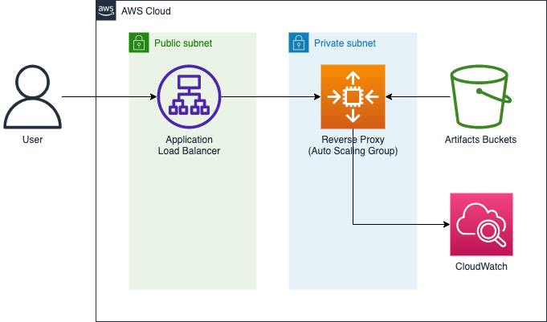

# Reverse Proxy Demo

This project demonstrates an approach to host a reverse proxy (a Golang project) on AWS Auto Scaling Group and use
CloudFormation as IaC.

## Architecture

### Components

* `Artifacts Bucket` An S3 Bucket which stores reverse proxy project binary (a Golang project).
* `Reverse Proxy` An Auto Scaling Group which download reverse proxy project binary from artifacts bucket, and run it as
  a service (systemd). It uses CloudWatch Agent to send log and metric to AWS CloudWatch, and use logrotate to manage
  the reverse proxy log.
* `Application Load Balancer` An load balancer which routes incoming user request to reverse proxy.

### Diagram

## Deploy

### Prerequisites

* An AWS IAM user account which has enough permission to deploy:
    * VPC (Subnets, Route Tables, NAT Gateway...etc.)
    * Application Load Balancer
    * IAM Role
    * Auto Scaling Group and Launch Template
    * S3
    * CloudWatch Alarm and Log Group
* Set up `AWS_ACCESS_KEY_ID`, `AWS_SECRET_ACCESS_KEY` and `AWS_DEFAULT_REGION` in `.env` file.

### Deploy with Docker

* Simply run `docker compose run --rm deployer make deploy` to run lint, build, and deploy the solution.
